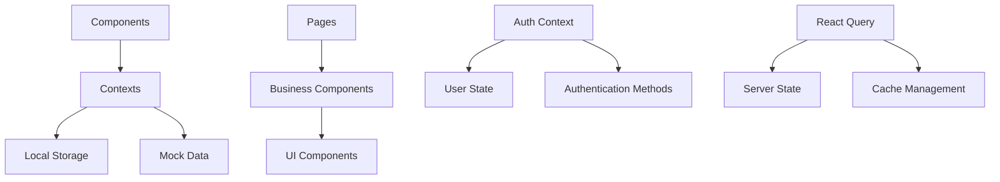

# Arquitetura do Sistema - E-commerce de Eletrônicos

## 📋 Visão Geral

Este documento descreve a arquitetura técnica do sistema de e-commerce, incluindo estrutura de componentes, fluxo de dados, padrões utilizados e decisões arquiteturais.

## 🏗️ Arquitetura Geral

### Padrão Arquitetural
- **Single Page Application (SPA)** com React
- **Component-Based Architecture** 
- **Atomic Design** para organização de componentes
- **Context + Hooks** para gerenciamento de estado
- **Route-Based Code Splitting** (preparado para implementação)

### Estrutura de Camadas

```
┌─────────────────────────────────────┐
│           Presentation Layer        │
│  (Pages, Components, UI Elements)   │
├─────────────────────────────────────┤
│            Business Layer           │
│   (Contexts, Hooks, Utils)          │
├─────────────────────────────────────┤
│             Data Layer              │
│    (Mock Data, API Calls)           │
└─────────────────────────────────────┘
```

## 📁 Organização de Componentes

### Hierarquia de Componentes

```
Components/
├── 🎯 Pages (Rotas principais)
│   ├── Index.tsx              # Página inicial
│   ├── ProductList.tsx        # Listagem de produtos
│   ├── ProductDetail.tsx      # Detalhes do produto
│   ├── CartPage.tsx           # Carrinho
│   ├── CheckoutPage.tsx       # Checkout
│   ├── LoginPage.tsx          # Login
│   ├── RegisterPage.tsx       # Cadastro
│   └── admin/                 # Páginas administrativas
│
├── 🧩 Layouts (Estrutura base)
│   ├── Layout.tsx             # Layout padrão
│   ├── AdminLayout.tsx        # Layout admin
│   ├── Navbar.tsx             # Navegação
│   └── Footer.tsx             # Rodapé
│
├── 🛍️ Business Components
│   ├── product/               # Componentes de produto
│   ├── cart/                  # Componentes do carrinho
│   ├── admin/                 # Componentes admin
│   └── sections/              # Seções da página
│
└── 🎨 UI Components (Atomic)
    ├── button.tsx             # Botão base
    ├── input.tsx              # Input base
    ├── card.tsx               # Card base
    └── ...                    # Outros componentes UI
```

### Padrão de Nomenclatura

```typescript
// Componentes: PascalCase
export const ProductCard = () => { ... }

// Hooks: camelCase com prefixo "use"
export const useAuth = () => { ... }

// Contextos: PascalCase com sufixo "Context"
export const AuthContext = createContext<AuthContextType>()

// Utilitários: camelCase
export const formatPrice = (price: number) => { ... }

// Tipos/Interfaces: PascalCase
interface Product { ... }
type AuthContextType = { ... }
```

## 🔄 Fluxo de Dados

### Arquitetura de Estado



### Contextos e Estado Global

#### AuthContext
```typescript
interface AuthContextType {
  user: User | null;
  isAuthenticated: boolean;
  isAdmin: boolean;
  login: (email: string, password: string) => Promise<boolean>;
  register: (name: string, email: string, password: string) => Promise<boolean>;
  logout: () => void;
}
```

**Responsabilidades:**
- Gerenciar estado de autenticação
- Persistir dados no localStorage
- Controlar acesso a rotas protegidas
- Fornecer métodos de login/logout

#### Estado Local vs Global

| Tipo de Estado | Escopo | Estratégia |
|----------------|--------|-----------|
| Autenticação | Global | AuthContext |
| Carrinho | Global | Context (futuro) |
| Formulários | Local | React Hook Form |
| UI State | Local | useState |
| Server Data | Global | React Query |

## 🛣️ Sistema de Roteamento

### Estrutura de Rotas

```typescript
Routes:
├── / (Public)                    # Página inicial
├── /produtos (Public)            # Lista de produtos
├── /categoria/:slug (Public)     # Produtos por categoria
├── /produto/:id (Public)         # Detalhes do produto
├── /carrinho (Public)            # Carrinho
├── /login (Public)               # Login
├── /cadastro (Public)            # Registro
├── /checkout (Protected)         # Checkout
├── /admin (Protected/Admin)      # Dashboard admin
├── /admin/produtos (Protected)   # Gestão de produtos
└── /admin/pedidos (Protected)    # Gestão de pedidos
```

### Proteção de Rotas

```typescript
// Middleware de proteção (conceitual)
const ProtectedRoute = ({ children, adminOnly = false }) => {
  const { isAuthenticated, isAdmin } = useAuth();
  
  if (!isAuthenticated) return <Navigate to="/login" />;
  if (adminOnly && !isAdmin) return <Navigate to="/" />;
  
  return children;
};
```

## 🎨 Sistema de Design

### Design Tokens

```css
/* Cores Semânticas */
--primary: 196 69% 49%;           /* Azul principal */
--secondary: 210 40% 96.1%;       /* Cinza claro */
--destructive: 0 84.2% 60.2%;     /* Vermelho para erros */
--muted: 210 40% 96.1%;           /* Cinza suave */

/* Espacamento */
--radius: 0.5rem;                 /* Border radius padrão */

/* Tipografia */
font-family: 'Inter', sans-serif;  /* Fonte principal */
```

### Variantes de Componentes

```typescript
// Exemplo: Button variants
const buttonVariants = cva(
  "inline-flex items-center justify-center rounded-md",
  {
    variants: {
      variant: {
        default: "bg-primary text-primary-foreground hover:bg-primary/90",
        destructive: "bg-destructive text-destructive-foreground",
        outline: "border border-input bg-background hover:bg-accent",
        secondary: "bg-secondary text-secondary-foreground hover:bg-secondary/80",
        ghost: "hover:bg-accent hover:text-accent-foreground",
        link: "text-primary underline-offset-4 hover:underline",
      },
      size: {
        default: "h-10 px-4 py-2",
        sm: "h-9 rounded-md px-3",
        lg: "h-11 rounded-md px-8",
        icon: "h-10 w-10",
      },
    },
    defaultVariants: {
      variant: "default",
      size: "default",
    },
  }
)
```

## 🔧 Utilitários e Helpers

### Formatação de Dados

```typescript
// utils/formatPrice.ts
export const formatPrice = (price: number): string => {
  return new Intl.NumberFormat('pt-BR', {
    style: 'currency',
    currency: 'BRL'
  }).format(price);
};

// utils/slugify.ts
export const slugify = (text: string): string => {
  return text
    .toLowerCase()
    .replace(/[^a-z0-9]+/g, '-')
    .replace(/(^-|-$)/g, '');
};
```

### Validações

```typescript
// lib/validations.ts
export const validateEmail = (email: string): boolean => {
  const emailRegex = /^[^\s@]+@[^\s@]+\.[^\s@]+$/;
  return emailRegex.test(email);
};

export const validatePassword = (password: string): boolean => {
  return password.length >= 6;
};
```

## 📱 Responsividade

### Breakpoints Strategy

```typescript
// tailwind.config.ts
screens: {
  'sm': '640px',    # Mobile landscape
  'md': '768px',    # Tablet
  'lg': '1024px',   # Desktop small
  'xl': '1280px',   # Desktop
  '2xl': '1400px'   # Desktop large
}

// Uso em componentes
className="grid grid-cols-1 md:grid-cols-2 lg:grid-cols-3 xl:grid-cols-4"
```

### Mobile-First Approach

```css
/* Base: Mobile */
.product-grid {
  @apply grid grid-cols-1 gap-4;
}

/* Tablet */
@screen md {
  .product-grid {
    @apply grid-cols-2 gap-6;
  }
}

/* Desktop */
@screen lg {
  .product-grid {
    @apply grid-cols-3 gap-8;
  }
}
```

## 🔐 Segurança

### Autenticação JWT

```typescript
// Fluxo de autenticação
1. User submits credentials
2. Validate credentials (mock simulation)
3. Generate JWT token (future implementation)
4. Store token in localStorage
5. Include token in API requests
6. Validate token on protected routes
```

### Proteção XSS

```typescript
// Sanitização de dados (conceitual)
const sanitizeInput = (input: string): string => {
  return input
    .replace(/</g, '&lt;')
    .replace(/>/g, '&gt;')
    .replace(/"/g, '&quot;');
};
```

## 📊 Performance

### Otimizações Implementadas

1. **Lazy Loading de Imagens**
   ```typescript
   
   ```

2. **Memoização de Componentes**
   ```typescript
   const ProductCard = memo(({ product }: ProductCardProps) => {
     // Component logic
   });
   ```

3. **Otimização de Re-renders**
   ```typescript
   const ProductList = () => {
     const memoizedProducts = useMemo(() => 
       filterProducts(products, filters), 
       [products, filters]
     );
   };
   ```

### Métricas de Performance

| Métrica | Target | Implementação |
|---------|--------|---------------|
| First Contentful Paint | < 2s | Code splitting, lazy loading |
| Largest Contentful Paint | < 3s | Image optimization |
| Cumulative Layout Shift | < 0.1 | Fixed dimensions |
| Time to Interactive | < 4s | Bundle optimization |

## 🧪 Testabilidade

### Estratégia de Testes (Preparado)

```typescript
// Estrutura preparada para testes
describe('ProductCard', () => {
  it('should render product information correctly', () => {
    // Test implementation
  });
  
  it('should handle add to cart action', () => {
    // Test implementation
  });
});

// Mock de contextos
const mockAuthContext = {
  user: mockUser,
  isAuthenticated: true,
  login: jest.fn(),
  logout: jest.fn()
};
```

## 🔄 Padrões de Desenvolvimento

### Hooks Customizados

```typescript
// hooks/useLocalStorage.ts
export const useLocalStorage = <T>(
  key: string, 
  initialValue: T
): [T, (value: T) => void] => {
  // Implementation
};

// hooks/useAuth.ts
export const useAuth = () => {
  const context = useContext(AuthContext);
  if (!context) {
    throw new Error('useAuth must be used within AuthProvider');
  }
  return context;
};
```

### Error Boundaries (Preparado)

```typescript
class ErrorBoundary extends Component {
  state = { hasError: false };
  
  static getDerivedStateFromError(error: Error) {
    return { hasError: true };
  }
  
  componentDidCatch(error: Error, errorInfo: ErrorInfo) {
    console.error('Error caught by boundary:', error, errorInfo);
  }
  
  render() {
    if (this.state.hasError) {
      return <ErrorFallback />;
    }
    return this.props.children;
  }
}
```

## 📈 Escalabilidade

### Preparação para Crescimento

1. **Modularização**
   - Componentes independentes
   - Hooks reutilizáveis
   - Utilitários separados

2. **State Management**
   - Context API para estado simples
   - Preparado para Redux/Zustand

3. **Code Splitting**
   - Rotas preparadas para lazy loading
   - Componentes pesados isolados

4. **API Integration**
   - Estrutura preparada para APIs reais
   - React Query para cache

### Futuras Implementações

```typescript
// api/client.ts (estrutura preparada)
export const apiClient = {
  get: (url: string) => fetch(url).then(res => res.json()),
  post: (url: string, data: any) => fetch(url, {
    method: 'POST',
    body: JSON.stringify(data)
  }),
  // ... outros métodos
};

// stores/productStore.ts (preparado para Zustand)
interface ProductStore {
  products: Product[];
  loading: boolean;
  fetchProducts: () => Promise<void>;
}
```

## 🔍 Monitoramento e Debug

### Ferramentas de Debug

1. **React DevTools**
   - Component tree inspection
   - Props and state debugging

2. **Console Logging**
   ```typescript
   if (process.env.NODE_ENV === 'development') {
     console.log('Debug info:', data);
   }
   ```

3. **Error Tracking** (Preparado)
   ```typescript
   const reportError = (error: Error, context: string) => {
     // Send to error tracking service
     console.error(`[${context}]:`, error);
   };
   ```

---

**Esta arquitetura foi projetada para ser escalável, maintível e facilmente extensível conforme o projeto cresce.**